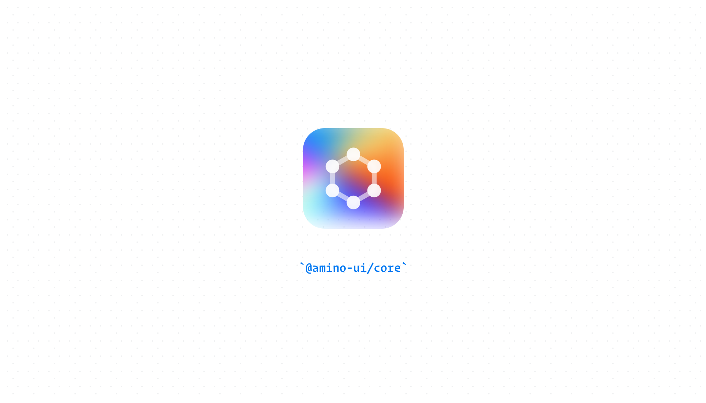

[](https://www.npmjs.com/package/@zonos/amino)

> Building blocks for cross-border experiences

## Quick start

### HTTPS proxy

In order for cookies to passed properly we need to use the same domain and HTTPS. The development server runs on http by default. One solution for resolving this issue is to add [`local-ssl-proxy`](https://www.npmjs.com/package/local-ssl-proxy) to your environment so cookies will be properly seen on localhost.

```shell script
$ pnpm add -g local-ssl-proxy
```

In order for the HTTPS request to be routed properly, you will need to modify your `/etc/hosts` file and add some redirects:

```
127.0.0.1 dev.amino.zonos.com
```

<details>
  <summary>Start dev server, start proxy</summary>

In the terminal, run the following:

```sh
$ pnpm dev
```

To also open the browser to the page (https://dev.amino.zonos.com), you can use:

```sh
$ pnpm dev:open
```

</details>

## Documentation

### CSS modules

We use [`typed-scss-modules`](https://www.npmjs.com/package/typed-scss-modules) to generate types for our scss modules. It will watch `.scss` files in the background and update them, but any file additions will require you to run `build:scss:types`.

### MCP Documentation Server

The MCP (Model Context Protocol) server provides component documentation to consuming applications and AI assistants via API endpoints. It consists of two main parts:

#### 1. Documentation Extraction

The documentation extractor runs during the build process to extract structured documentation from your component files:

```sh
# Extract component documentation data
pnpm extract:mcp-data
```

This command:
- Scans component directories to locate documentation files
- Extracts TypeScript interfaces and JSDoc comments
- Generates structured documentation as JSON files in `public/mcp-data/`

#### 2. MCP API Server

The MCP API server is implemented as NextJS API routes that serve the generated documentation:

```sh
# Build the NextJS server for production deployment
pnpm build:mcp-server

# Run the MCP server locally for development
pnpm mcp:server
```

After starting the server, you can verify it's working by accessing:
```
http://localhost:3000/api/mcp/v1/health
```

#### Deploying to Vercel

When deploying the MCP server to Vercel, set the build command to:
```
pnpm extract:mcp-data && pnpm build:mcp-server
```

This ensures that:
1. Documentation is extracted from component files
2. The NextJS API server is built for production

For configuration details, see the [MCP architecture specification](./specs/mcp-resources/01-architecture.spec.md).

### - Available features in Amino:

- [Style generation (generate style constants and css file)](./build-utils/css/README.md)
- [Icon component generation process (generate optimized react components based on SVG downloaded from Figma/any sources)](./svgReact/icons/README.md)
- [Flag component generation process (generate optimized react components for flag svgs from smallest svg size of AWS and Figma)](./svgReact/flags/README.md)

### - Feature in progress

- Fully replaced styled component with SCSS modules to utilize server component and server side rendering of React and NextJS\*\*

#### - CSS modules conversion process

1. Make sure you're running `pnpm dev` so that you will have the script watch and have your incoming scss type file generated.
2. Go to the component you want to convert and open the file
3. Add a scss file with this format `[Component].module.scss`. Ex: If I want to convert `Layout.ts` component, the scss file will be named `Layout.module.scss`
4. Open Github copilot chat and ask this:
   ```
   Rewrite this code to use css module instead of styled component. Make sure all the theme variables that are used in styled component, use scss variable with prefix $amino instead (ex: $amino-v3-shadow-base)
   ```
5. Copilot will give you the scss file content and the new code suggestion, you now just need to filter and adjust it a bit

### - Configuration

- Install and setup library dependencies
  ```
  pnpm install && pnpm build:theme
  ```
- Development
  ```
  pnpm dev
  ```
- Unit testing
  ```
  pnpm test
  ```

To run the visual tests (with puppeteer), you must have storybook open and running so puppeteer can navigate to it.

### - Release flow

1. Create a pull request after completing a task and wait for it to be approved.

2. Make sure you have no pending changes on your source control, otherwise when you run the following versioning command in step 3, it will error out and you will have to start over.

3. Once the PR is approved, determine which version you want to add to the release (patch, minor, major) and run the command below.
   **Note**: When running these commands it will build the project, run the tests, and increase the version in the `package.json` file according to the version type you choose. It will also create a tag for you automatically. **(be aware that the `all.ts` file may change and you need to push it to the PR along with the version)**

- Patch
  ```
  pnpm version:patch
  ```
- Minor
  ```
  pnpm version:minor
  ```
- Major
  ```
  pnpm version:major
  ```

### - Naming rule for auto-importing suggestion

After project is bundled, all files that started with `"_"` will always be available, but VS Code will not suggest the path for the auto import suggestion.
